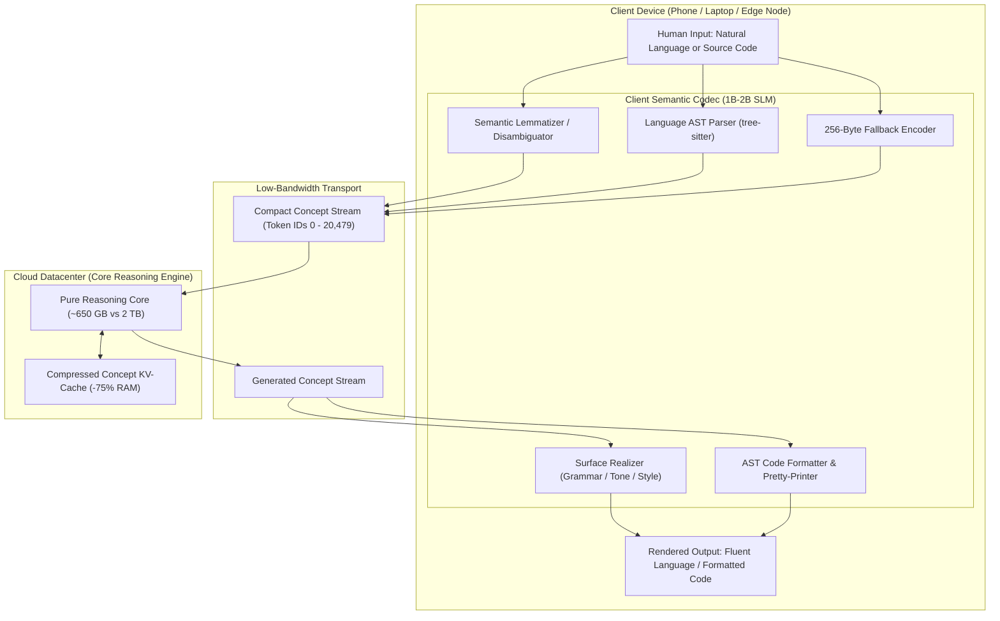

# ConceptLLM: Edge-Cloud Semantic Split Architecture
An experimental AI architecture that decouples **high-level conceptual reasoning** from **surface-level linguistic and code formatting**.

By replacing massive 200,000-token BPE vocabularies with a unified **~20,000 Concept Vocabulary** (incorporating semantic lemmas, programming AST nodes, and byte-level fallbacks), this system slashes datacenter VRAM and power demands by **~65%** while boosting effective generation throughput by **3× to 5×**.

---

## 1. Executive Summary & Problem Statement

Current frontier Large Language Models (LLMs) suffer from severe architectural inefficiency:
1. **Surface Redundancy:** A massive portion of an LLM's parameter capacity and training budget is wasted learning thousands of surface variations for the same fundamental concept (e.g., casing, plurals, verb tenses, multilingual duplicates, formatting tokens).
2. **Bloated Vocabularies:** Modern tokenizers (128k to 256k tokens) inflate embedding and projection matrices, consuming up to 25% of parameter memory in smaller models and saturating memory bandwidth during inference.
3. **Power & Hardware Bottlenecks:** Datacenter clusters require terabytes of VRAM (e.g., 2 TB+ for clusters running models like Kimi k3 / DeepSeek / 400B+ models) largely driven by massive dynamic KV caches and dense parameter arrays that spend FLOPs outputting conversational filler.

**ConceptLLM** solves this by splitting the workload between an on-device **Client Semantic Codec** and a cloud **Core Reasoning Engine**.

---

## 2. System Architecture



---

## 3. The 20,000 Unified Token Structure

Instead of arbitrary byte-pair statistics, the vocabulary space is strictly partitioned into three specialized functional tiers:

| Token Tier | ID Range | Size | Purpose & Characteristics |
| :--- | :--- | :--- | :--- |
| **Semantic Concepts** | `0x0000 – 0x464F` | ~18,000 | Canonical root concepts (lemmas), actions, universal entities, and semantic relationships (e.g., `[ACTION:ACCELERATE]`, `[CONCEPT:PHOTOSYNTHESIS]`). |
| **AST Code Nodes** | `0x4650 – 0x4E1F` | ~2,000 | Language-agnostic programming AST nodes (e.g., `[FOR_LOOP]`, `[BIN_OP:ADD]`, `[TRY_CATCH]`, `[VAR_DECL]`). Guaranteed syntax validity. |
| **Byte Fallback** | `0x4E20 – 0x4F1F` | 256 | Raw byte values (`0x00 – 0xFF`) for arbitrary literals, UUIDs, cryptographic hashes, and rare mathematical notation. |
| **Special Control** | `0x4F20 – 0x4FFF` | ~224 | Framing, delimiters, modality switches, and `<EOS>` markers. |
| **Total** | | **~20,480** | **Complete, closed-loop representation of language, code, and raw data.** |

---

## 4. Operational Walkthrough

### A. Natural Language Flow
1. **Input:** The user types: *"Could you please give me a summary of how photosynthesis works?"*
2. **Client Compression:** The local lightweight model (1B–2B parameters) strips polite filler and surface syntax into dense concept tokens:
   ```
   [ACTION:SUMMARIZE] [CONCEPT:PHOTOSYNTHESIS] [PROCESS:MECHANISM]
   ```
3. **Server Inference:** The server processes 3 concept tokens instead of 14 BPE tokens. It computes the factual transition and outputs:
   ```
   [CONCEPT:PLANT] [ABSORB:SUNLIGHT] [INPUT:H2O+CO2] [OUTPUT:GLUCOSE+O2]
   ```
4. **Client Expansion:** The local model expands the concepts into fluent natural language matching the user's preferred tone:
   > *"Photosynthesis is the process where plants absorb sunlight to convert water and carbon dioxide into glucose and oxygen."*

### B. Programming & Code Flow
1. **Input:** The user requests an algorithm in Rust or Python.
2. **Server Inference:** The server generates pure **AST Node Tokens** representing algorithmic structure, independent of surface indentation or syntax quirks.
3. **Client Pretty-Printing:** The client's tree-sitter formatter compiles the AST directly into valid code:
   * **No missing brackets or indentation errors** (syntax correctness is guaranteed by the grammar tree).
   * **Language flexibility:** The same AST can be rendered into Python, Rust, Go, or C on demand.

---

## 5. Performance & Resource Impact

Comparison against a standard 2 TB production deployment (e.g., Kimi k3 / frontier MoE scale with 2M context window):

| Metric | Traditional Model (200k BPE) | ConceptLLM Architecture | Improvement |
| :--- | :--- | :--- | :--- |
| **Vocabulary Size** | 200,000 | ~20,480 | **90% reduction** |
| **Output Head / Vocab RAM** | ~10 GB | ~1 GB | **90% less vocab VRAM** |
| **Model Weights (Equal IQ)** | ~1,200 GB | ~450 GB | **~62% reduction** (no syntactic fluff stored) |
| **KV-Cache (2M-word context)**| ~800 GB | ~200 GB | **75% reduction** (denser token semantics) |
| **Total Server VRAM Required**| **~2,000 GB (2 TB)** | **~650 GB (~0.65 TB)** | **~67.5% System RAM Reduction** |
| **Hardware Node Required** | 24 – 32 × H100 (80GB) | 8 × H100 (80GB) | **Runs on a single 8-GPU node** |
| **Effective Response Speed** | Baseline (1.0×) | **3× – 5× faster** | Server emits 3× fewer tokens per idea |

---

## 6. Training Pipeline

1. **Step 1: Codec Pretraining (Client SLM)**
   * Train an asymmetric encoder-decoder (1B–2B parameters) on multi-language corpora and AST datasets (using tree-sitter) to map bi-directionally between surface text and canonical concept tokens.
2. **Step 2: Dataset Canonicalization**
   * Pass web-scale training data (15+ Trillion BPE tokens) through the frozen concept encoder, yielding a dense ~4 Trillion Concept Token dataset.
3. **Step 3: Core Reasoning Pretraining (Server)**
   * Pretrain the server foundation model strictly on the concept dataset. 100% of parameter updates reinforce logic, causal relations, mathematics, and factual associations.
4. **Step 4: End-to-End Alignment**
   * Tune using Reinforcement Learning with Verifiable Rewards (RLVR) across math and coding benchmarks, decoding server outputs via the client codec for standard evaluation.

---

## 7. Project Status & Roadmap

- [x] Initial conceptual architecture & vocabulary partition design.
- [ ] Build reference Tree-sitter AST to concept-token mapper.
- [ ] Train prototype 0.5B text-to-concept SLM codec.
- [ ] Benchmark token density ratios on standard datasets (GSM8k, HumanEval).
- [ ] Release open reference implementation and specification.
